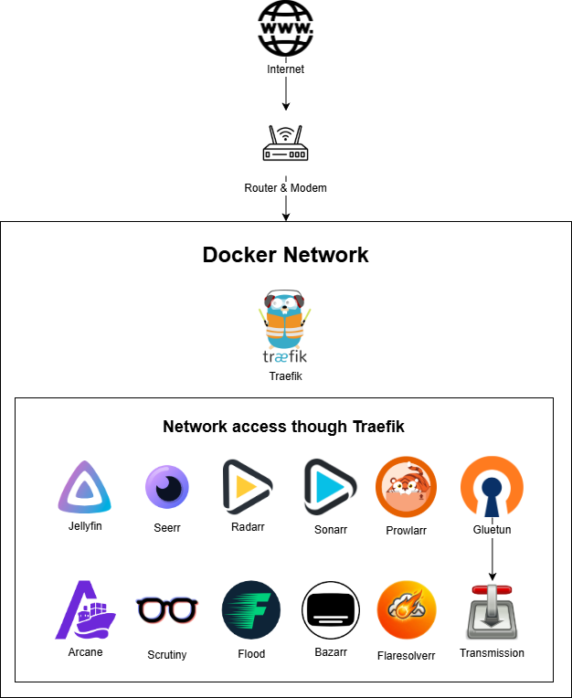

# Composes

A collection of my privately used container compose files.
Check out the [DNS](DNS.md) settings to manually set the right url's again.

## Overview



## All services

| Name         | Description                            |
| ------------ | -------------------------------------- |
| Arcane       | Dashboard for containers orchestration |
| Flood        | Torrent Web UI                         |
| Seerr        | Media Requester Web UI                 |
| Bazarr       | Subtitles finder                       |
| Gluetun      | VPN Network                            |
| Radarr       | Movie finder                           |
| Traefik      | Proxy/Gateway                          |
| Jellyfin     | Media Viewer                           |
| Sonarr       | Series/Anime finder                    |
| Scrutiny     | S.M.A.R.T. checker and Web UI          |
| Prowlarr     | Indexer for finding things             |
| Transmission | Torrenting client                      |

## Commands

1. Read through the README.md's in the other folders for more setup
2. Fill in the `.env` file if needed check the `.env.tmp` file as template.

Run `./setup.sh` to create folders, copy over defaults and setup the docker networks used.

Then run `./start.sh` to start the first time pulling of containers and make them all work.

To update running containers run `./upgrade.sh`.

Need to reset all the containers because of a mistake when developing? Use `./restart.sh`.

To stop the containers use the `./stop.sh` command.

Made an oopsie? remove everything with `./remove.sh`

## Folder structure

```txt
/home/nlxdodge/composes/ -> this repository.
/home/nlxdodge/composes/scripts -> houses all the scripts in the composes project to start all the stacks.
/home/nlxdodge/configurations/ -> for all the configurations used in containers, here everything will be stored that is non volatile.
```
