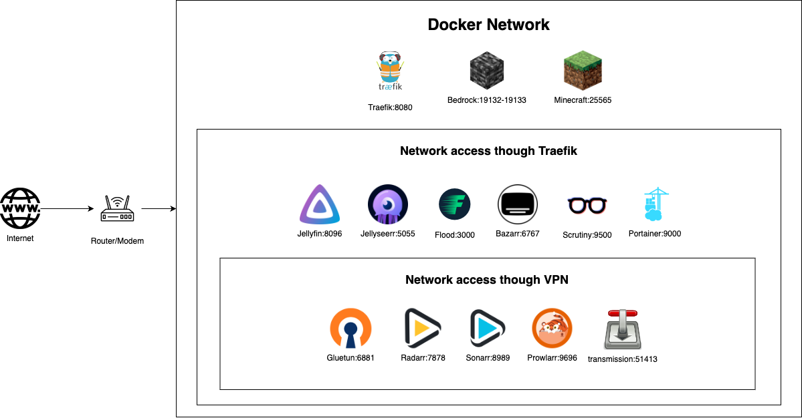

# Composes

A collection of my privately used container compose files.
Check out the [DNS](DNS.md) settings to manually set the right url's again.

## Overview



## All services

| Name         | Port  | Description                       |
| ------------ | ----- | --------------------------------- |
| Flood        | 3000  | Front-end Torrent Interface       |
| Portfolio    | 5000  | Self hosted portfolio             |
| Jellyseer    | 5055  | Media Requester for Jellyfin      |
| Postgres     | 5432  | Relational Database               |
| Bazarr       | 6767  | Subtitles downloader              |
| Gluetun      | 6881  | VPN Network for other containers  |
| SonarQube    | 7000  | Code Quality and Security scanner |
| Radarr       | 7878  | Movie finder                      |
| Scrutiny     | 8080  | S.M.A.R.T. viewer/notifier        |
| Traefik      | 8080  | Proxy/Gateway                     |
| Jellyfin     | 8096  | Media Viewer                      |
| Sonarr       | 8989  | Series/Anime finder               |
| Portainer    | 9000  | Container Management              |
| Prowlarr     | 9696  | Indexer for Radarr & Sonarr       |
| Transmission | 51413 | Torrent Client                    |

## Commands

1. Read through the README.md's in the other folders for more setup
2. Fill in the `.env` file if needed check the `.env.tmp` file as template.

Run `./setup.sh` to create folders, copy over defaults and setup the docker networks used.

Then run `./start.sh` to start the first time pulling of containers and make them all work.

To update running containers run `./upgrade.sh`.

Need to reset all the containers because of a mistake when developing? Use `./restart.sh`.

To stop the containers use the `./stop.sh` command.

Made an oopsie? remove everything with `./remove.sh`

## Folder structure

```txt
~/composes/ -> this repository.
~/composes/scripts -> houses all the scripts in the composes project to start all the stacks.
~/configurations/ -> for all the configurations used in containers, here everything will be stored that is non volatile.
```
